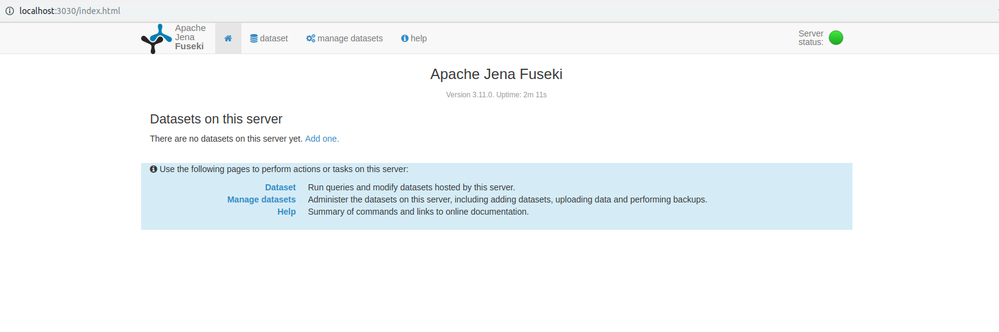
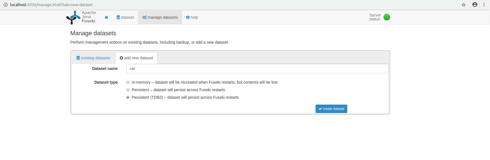
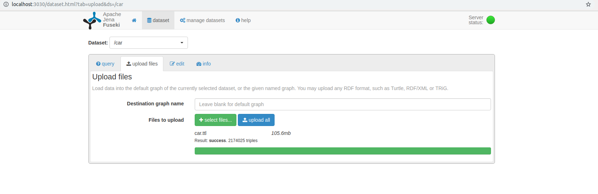
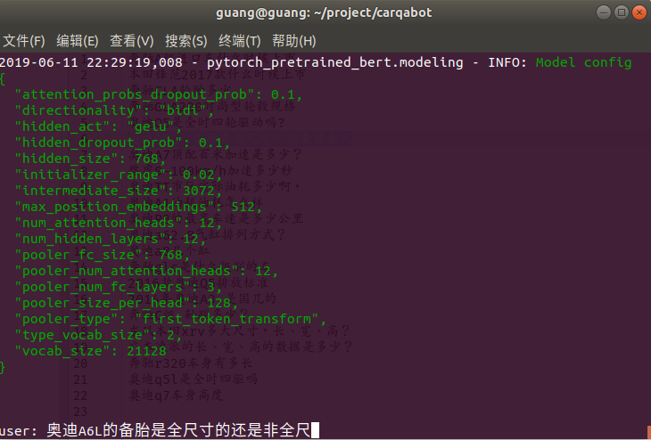
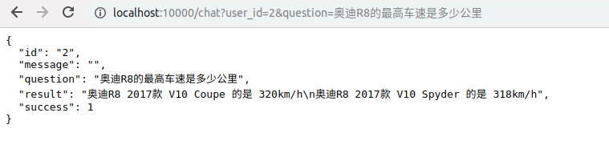

## 汽车问答系统

### 1 项目环境

1. ubuntu18.04

   安装方法见[网上安装教程](https://baijiahao.baidu.com/s?id=1616490790245132419&wfr=spider&for=pc)

2. python3.5

   安装anaconda即可

3. jena

   安装见[网上安装教程](http://www.ljlovelyforever.com/2019/04/25/jena%E7%9A%84%E5%AE%89%E8%A3%85%E5%92%8C%E4%BB%8B%E7%BB%8D/)，jena和Virtuoso只是一个载体，后面使用都是通过调用SPARQL Endpoint Server的接口而已。

### 2 使用方式

#### 1 数据和python环境准备

1. 启动jena

   ```shell
   进入jena目录, 执行以下命令
   ./fuseki-server
   ```

2. 知识图谱导入

   打开 http://localhost:3030/index.html，页面如下

   

   点击manage datasets，再点击页面中的add new dataset，如下，选择TDB2把数据保存到磁盘中，输入知识图谱的名字，这里为car，与代码中配置的SPARQL Endpoint Server对应即可。

   点击creat dataset后调到existing datasets，选择upload data后选择知识图谱数据文件car_data/kg/car.ttl后电upload now即可。

   

   因为选择保存到磁盘，所以数据导入一次即可，不用每次启动都导入。

3. python环境

   ```shell
   # 执行
   pip install -r requirements.txt
   ```


#### 2 启动

1. 交互式启动

   ```shell
   # 执行
   python3.5 chat.py
   ```

   

2. api形式

   ```
   # 执行
   python3.5 server.py
   ```

   用get方法请求api http://localhost:10000/chat 即可

   其中参数

   + user_id

     用户id

   + question

     问题

   样例如下

   http://localhost:10000/chat?user_id=2&question=奥迪R8的最高车速是多少公里  

    

   