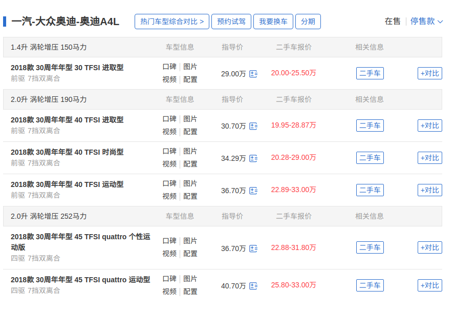
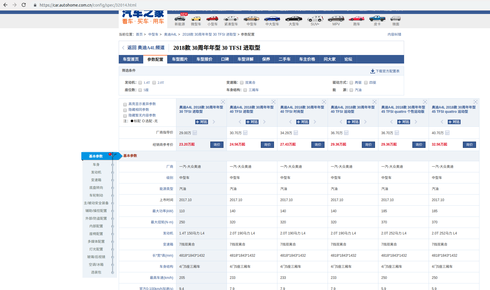

## 汽车问答系统技术文档

​	技术文档分为三部分进行介绍，分别为数据爬虫，知识图谱构建，模型。

### 1 数据爬虫

​	获取汽车的数据主要从网上的汽车网站获取，考虑到汽车之家的数据为当前最全的，而且其他网站的数据也没他多，因此选择爬取汽车之家的数据。爬取逻辑为先爬取品牌，然后根据品牌爬取各品牌下的车系，再根据车系爬去车型，通过车型爬取配置信息。

### 1.1 品牌与车系

​	汽车之家的车品牌数据可以通过以下url看到

```
https://www.autohome.com.cn/grade/carhtml/A.html
https://www.autohome.com.cn/grade/carhtml/B.html
...
https://www.autohome.com.cn/grade/carhtml/Z.html
```

​	分别代表了以各字母开头的品牌列表，以及各品牌下生产厂商，和生产厂商下的车系列表，如下


​	因此，可以分析页面的结构，抽取到品牌列表以及车系列表。

### 1.2 车型

​	通过1.1爬取的车系列表以及对应的url，如

```
奥迪A4L https://www.autohome.com.cn/692/
```

​	打开，页面如下


​	下拉可以找到该车系下面的在售车型列表


​	点击停售款，可以获取各个年份的车型，下图为2018年为例子。



​	分析页面结构，可以获取该页面下所有的年款车型id。

### 1.3 车型配置

​	通过1.2中获取的车型id，结合汽车之家的车型配置url的规则，构建所有出配置页面url，如

2018款 30周年年型 30 TFSI 进取型 的 id 为 32014，则可以得到url，如下

```
https://car.autohome.com.cn/config/spec/32014.html
```

​	进入页面



​	页面可以看到一个配置列表，需要的车型在第一列，但是因为汽车之家的反爬机制，获取到的页面源码是经过，具体的处理过程就是 会通过js动态选择某些词，然后将页面的这些词全部替换为特殊字符。具体解决办法参考网上的[解决方案](https://www.cnblogs.com/kangz/p/10011348.html)，主要是通过还原这些混淆的文本，替换回去。

### 1.4 汇总

​	通过爬取，获取的数据量为

| 数据     | 数量  |
| -------- | ----- |
| 汽车品牌 | 320   |
| 生产厂商 | 400   |
| 车系     | 3621  |
| 车型     | 29701 |

### 2 知识图谱构建

​	通过上面的数据，可以构建一个汽车的知识图谱，主要结构如下

| concept1 | relation | concept2 | 数量      |
| -------- | -------- | -------- | --------- |
| 汽车品牌 | 子品牌   | 生产厂商 | 400       |
| 汽车品牌 | 拥有     | 车系     | 3,621     |
| 生产厂商 | 拥有     | 车系     | 3,621     |
| 车型     | 所属品牌 | 汽车品牌 | 29,701    |
| 车型     | 所属品牌 | 生产厂商 | 29,701    |
| 车型     | 所属车型 | 车系     | 29,701    |
| 车型     | 配置     | 配置信息 | 1,786,049 |

​	通过以上结构，构建出知识图谱，rdf三元组数据量为 2,174,025。


### 3 模型