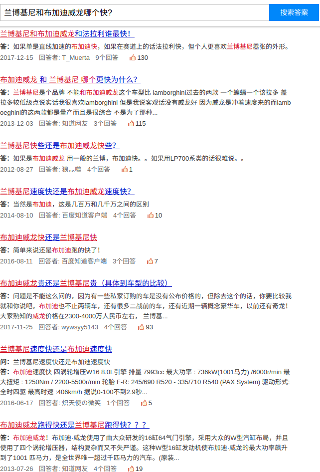
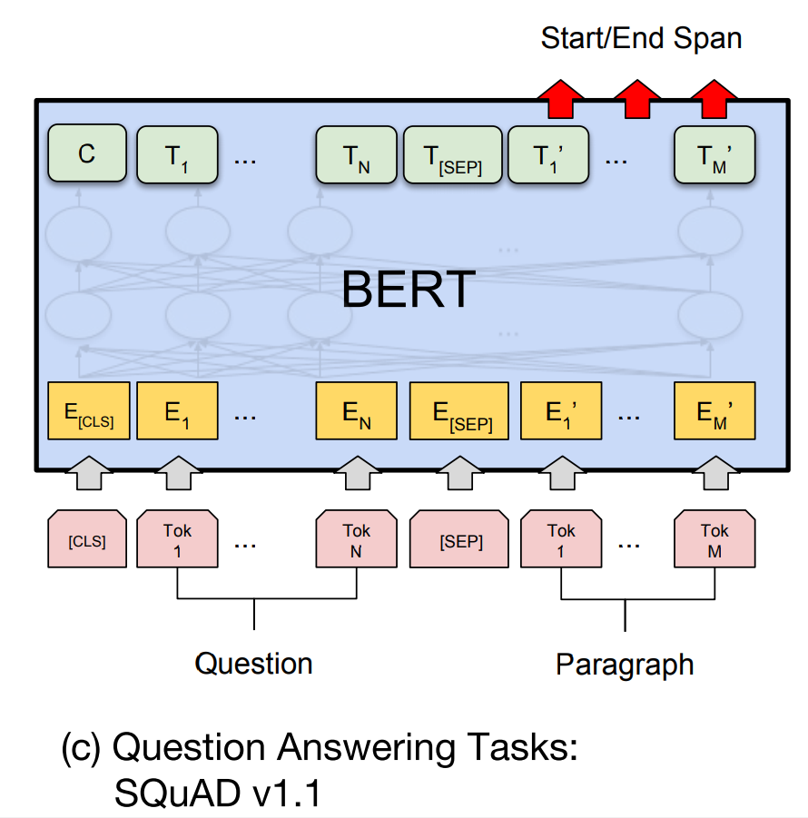

# 技术文档-DBQA

​	DBQA的技术文档分为两部分一个是文档检索，另外一个是阅读理解模型。

首先通过文档检索，检索出一些相关文档，然后将文档和用户问题通过阅读理解模型得到答案。


## 1 文档检索

​	在文档检索中，系统借助百度搜索系统，用用户问题在百度知道中进行搜索。

如 用户问题 "**兰博基尼和布加迪威龙哪个快**?"

在百度知道中搜索得到



​	解析网页后获取前10条搜索结果：

```json
{'question': '兰博基尼和布加迪威龙和法拉利谁最快！', 'doc': '答：如果单是直线加速的布加迪快，如果在赛道上的话法拉利快，但个人更喜欢兰博基尼嚣张的外形。'}
{'question': '布加迪威龙 和 兰博基尼 哪个更快为什么？', 'doc': '答：兰博基尼是个品牌 不能和布加迪威龙这个车型比 lamborghini过去的两款 一个蝙蝠一个该拉多 盖拉多较低级点说实话我很喜欢lamborghini 但是我说客观话没有威龙好 因为威龙是冲着速度来的而lamboeghini的这两款都是量产而且是很综合 不是为了那种...'}
{'question': '兰博基尼快些还是布加迪威龙快些？', 'doc': '答：如果是布加迪威龙 用一般的兰博，布加迪快。。如果用LP700系类的话很难说。。'}
{'question': '兰博基尼速度快还是布加迪威龙速度快？', 'doc': '答：当然是布加迪，这是几百万和几千万之间的区别'}
{'question': '布加迪威龙快还是兰博基尼快', 'doc': '答：简单来说还是布加迪跑的快了！'}
{'question': '布加迪威龙贵还是兰博基尼贵（具体到车型的比较）', 'doc': '答：问题是不能这么问的，因为有一些私家订购的车是没有公布价格的，但除去这个的话，你要比较我就和你说吧，布加迪也不止两辆车，还有很多二战前的车，还有近期一辆概念豪华车，以前还有奇龙！大家熟知的威龙价格在2300-4000万人民币左右， 兰博基...'}
{'question': '兰博基尼速度快还是布加迪速度快', 'doc': '答：布加迪速度快 四涡轮增压W16 8.0L引擎 排量 7993cc 最大功率 : 736kW(1001马力) /6000r/min 最大扭矩 : 1250Nm / 2200-5500r/min 轮胎 F-R: 245/690 R520 - 335/710 R540 (PAX System) 驱动形式: 全时四驱 最高时速 :406km/h 据说0-100不到2.9秒...'}
{'question': '布加迪威龙跑得快还是兰博基尼跑得快？？？', 'doc': '答：布加迪威龙！布加迪·威龙使用了由大众研发的16缸64气门引擎，采用大众的W型汽缸布局，并且使用了四个涡轮增压器，结构复杂而又不失严谨。这种W型16缸发动机使布加迪·威龙的最大功率飙升到了1001 匹马力，是全世界唯一超过千匹马力的汽车。(原装...'}
{'question': '兰博基尼和布加迪威龙哪个贵？', 'doc': '答：普通来看布加迪贵 但是兰博基尼有的型号的比布加迪贵，比如毒药，egoista都是限量版所以比普通布加迪贵。 车是不是二手也有关系，二手的话就难说了 还有不同国家的价格也不一样。 如果是改装车的话那要看改装费用 按现在（市面）可以买到的兰博...'}
{'question': '兰博基尼和布加迪威龙哪个好?', 'doc': '答：兰博基尼是个品牌 不能和布加迪威龙这个车型比 lamborghini过去的两款 一个蝙蝠一个该拉多 盖拉多较低级点说实话我很喜欢lamborghini 但是我说客观话没有威龙好 因为威龙是冲着速度来的而lamboeghini的这两款都是量产而且是很综合 不是为了那种...'}
```

​	因此可以获取到前10条结果当做10篇文档。

## 2 阅读理解模型

​	机器阅读理解是当前自然语言领域较热门的问题，主要通过建立一个模型使得机器能够通过阅读文档，回答文档相关的问题。

​	在第一章中，根据问题检索到了对应的一些文档，那么可以将文档和问题输入模型。如：

```
{'question': '兰博基尼和布加迪威龙和法拉利谁最快！', 'doc': '答：如果单是直线加速的布加迪快，如果在赛道上的话法拉利快，但个人更喜欢兰博基尼嚣张的外形。'}
问题为 “兰博基尼和布加迪威龙哪个快**?”

得到结果为
{'confidence': 1.0, 'module': 'dbqa', 'answer': '如果单是直线加速的布加迪快'}
```

​	SQuAD 是斯坦福大学于2016年推出的数据集，一个**阅读理解数据集**，给定一篇文章，准备相应问题，需要算法给出问题的答案。此数据集所有文章选自维基百科，数据集的量为当今其他数据集(例如，WikiQA)的**几十倍之多**。一共有**107,785问题，以及配套的 536 篇文章**。

​	在阅读理解领域，中文数据有百度[DuReader](http://ai.baidu.com/broad/introduction?dataset=dureader)下的数据，但是该数据与SQuAD不太一样，因为SQuAD的答案是文档中的一串连续字符串，而DuReader中的答案可以是连续字符串，也可以是不连续的字符串。

### 2.1 数据准备

​	因为系统中应用的语言为中文，因此我们将百度dureader数据转换为SQuAD格式之后，只保留答案为连续字符串的数据。

​	得到训练集22889条，测试集560条，样例数据如下：

```json
[{
		"paragraphs": [{
			"context": "建设银行的理财产品为什么到期了,钱还没有到账?全部回答(1)请点击举报理由网贷问答—有问必答10分钟答案即可获取没有网贷之家账号?立即注册",
			"qas": [{
				"question": "建行理财到期钱没了",
				"is_impossible": false,
				"id": 181576,
				"answers": [{
					"text": "的理财产品为什么到期了,钱还没有到账",
					"answer_start": 4
				}]
			}]
		}],
		"title": "N.A."
	},
	{
		"paragraphs": [{
			"context": "就是秋占生的女儿的意思。短时间交易里面,不要用周易了",
			"qas": [{
				"question": "秋占生女是什么意思",
				"is_impossible": false,
				"id": 181577,
				"answers": [{
					"text": "就是秋占生的女儿的意思。",
					"answer_start": 0
				}]
			}]
		}],
		"title": "N.A."
	},
	{
		"paragraphs": [{
			"context": "一般给予迪巧钙的比较多cn#aLpLaLVakp2016-07-1713:07宝宝知道提示您:回答为网友贡献,仅供参考。",
			"qas": [{
				"question": "美邦钙宝跟迪巧哪个好",
				"is_impossible": false,
				"id": 181606,
				"answers": [{
					"text": "一般给予迪巧钙的比较多",
					"answer_start": 0
				}]
			}]
		}],
		"title": "N.A."
	},
	{
		"paragraphs": [{
			"context": "一般从宠物身上",
			"qas": [{
				"question": "尘虱是怎么样产生的",
				"is_impossible": false,
				"id": 181607,
				"answers": [{
					"text": "一般从宠物身上",
					"answer_start": 0
				}]
			}]
		}],
		"title": "N.A."
	},
	{
		"paragraphs": [{
			"context": "主宰是大龙,暴君是小龙主宰就是大龙对应lol分别是大龙小龙",
			"qas": [{
				"question": "哪个是暴君哪个是主宰",
				"is_impossible": false,
				"id": 181628,
				"answers": [{
					"text": "主宰是大龙,暴君是小龙",
					"answer_start": 0
				}]
			}]
		}],
		"title": "N.A."
	}
]
```

### 2.2 模型介绍

​	阅读理解模型可以使用模型选择基于bert的阅读理解模型，结构图如下：



​	将问题和段落以字形式进行切分得到Tok序列，通过bert进行表征，最终得到段落每个字的语义向量T，然后在T上接上两个MLP网络，分别为预测答案开始和预测答案结尾指针的二分类网络即可。 

### 2.3 效果评估

​	对测试集560条数据进行评估，评估方法使用BLEU和ROUGE，结果如下：

| metrics | value |
| ------- | ----- |
| Bleu-1  | 65.14 |
| Bleu-2  | 63.47 |
| Bleu-3  | 62.11 |
| Bleu-4  | 60.88 |
| Rouge-L | 67.89 |

​	具体实验结果见report/dbqa.xlsx。