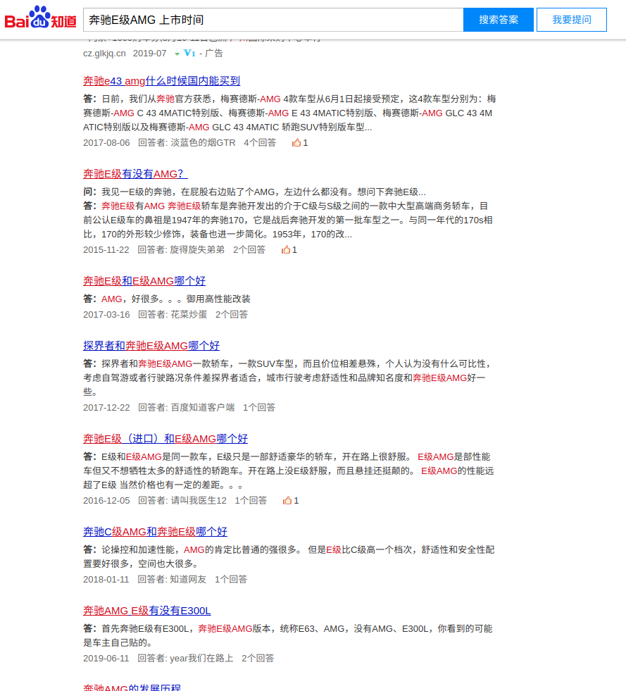
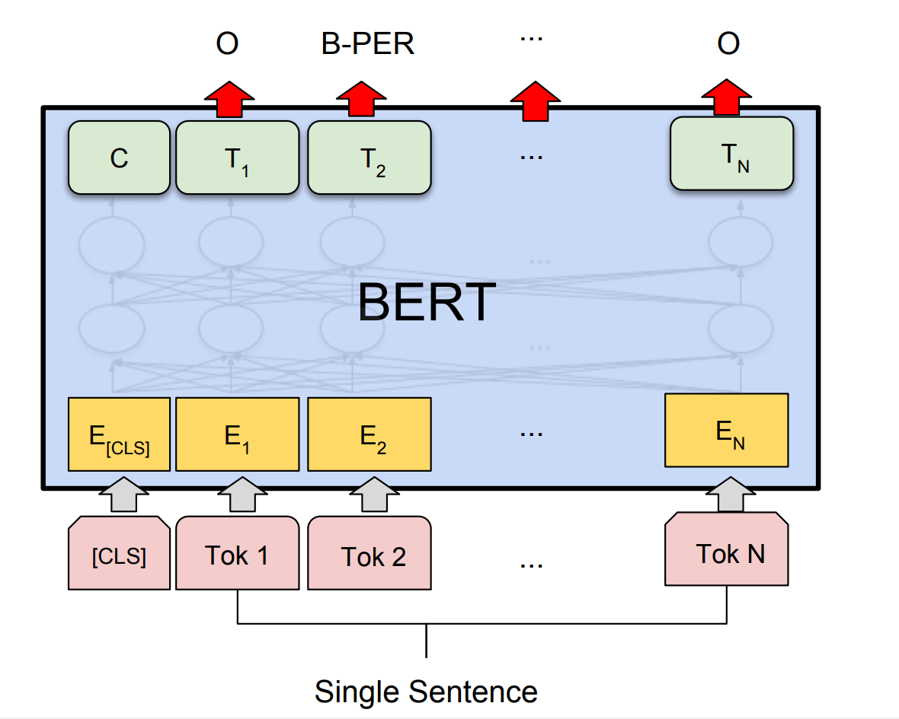
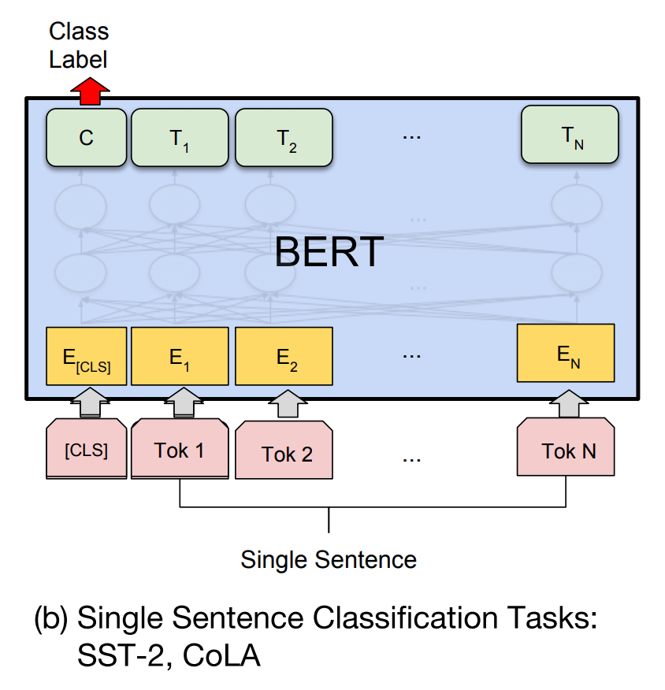
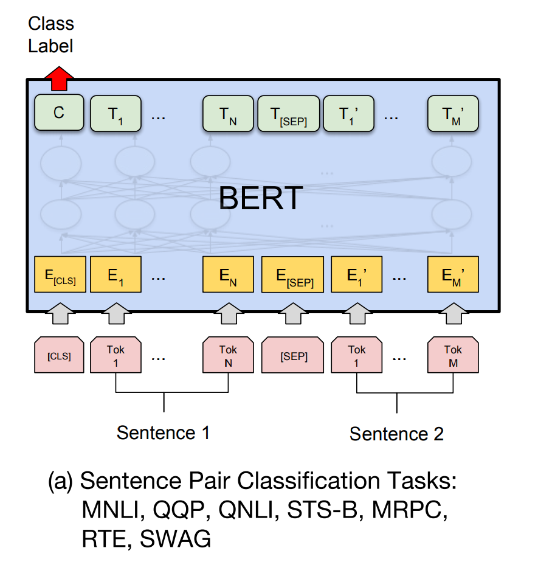

# 技术文档-KBQA

​	KBQA的技术文档分为两部分一个是KBQA的整体技术路线，以及技术路线中各个模型的介绍。

## 1 技术路线

​	该技术路线主要将KBQA分为三部分，实体识别与实体链接，关系识别，sparql查询，其中每个部分分为一到多种方法实现。

​	当用户输入一个句子之后，问答系统会从用户的句子中抽取对应的实体提及，然后根据抽取的实体提及通过实体链接映射到知识图谱中的实体。同时，系统也会从句子中识别到用户想要问的关系，然后结合实体和关系，即可使用sparql语言从知识图谱中查询得到对应的结果。

​	样例如下：

​	当用户问：**奥迪R8的最高车速是多少公里** 时，可以通过命名实体识别的方法识别到**奥迪R8**，然后根据知识图谱中的数据，可以直接找到 奥迪**R8(http://www.demo.com/kg/item/train#s511)** 这个实体。通过关系识别，可以知道用户问的是**最高车速(http://www.demo.com/predicate/最高车速(km/h)) **该关系，因此可以根据以下sparql语句查询对应的结果：

```sparql
PREFIX p:<http://www.demo.com/predicate/>
PREFIX item:<http://www.demo.com/kg/item/>
PREFIX rdf: <http://www.w3.org/1999/02/22-rdf-syntax-ns#>
PREFIX rdfs: <http://www.w3.org/2000/01/rdf-schema#>

SELECT ?car ?time ?object ?name
WHERE {
    ?car p:CarTrain <http://www.demo.com/kg/item/train#s511>;
    p:上市时间 ?time;
    <http://www.demo.com/predicate/最高车速(km/h)> ?object;
    rdfs:label ?name.
}order by DESC(?time)
```

​	结果如下

| "car"                                        | "time"    | "object" | "name"                                     |
| -------------------------------------------- | --------- | -------- | ------------------------------------------ |
| "http://www.demo.com/kg/item/car#spec_30129" | "2017.06" | "320"    | "奥迪R8 2017款 V10 Coupe"                  |
| "http://www.demo.com/kg/item/car#spec_30130" | "2017.06" | "318"    | "奥迪R8 2017款 V10 Spyder"                 |
| "http://www.demo.com/kg/item/car#spec_26925" | "2016.07" | "330"    | "奥迪R8 2016款 V10 Coupe Performance"      |
| "http://www.demo.com/kg/item/car#spec_17195" | "2013.1"  | "314"    | "奥迪R8 2014款 5.2 FSI quattro"            |
| "http://www.demo.com/kg/item/car#spec_17305" | "2013.1"  | "311"    | "奥迪R8 2014款 Spyder 5.2 FSI quattro"     |
| "http://www.demo.com/kg/item/car#spec_17306" | "2013.1"  | "300"    | "奥迪R8 2014款 4.2 FSI quattro"            |
| "http://www.demo.com/kg/item/car#spec_17307" | "2013.1"  | "300"    | "奥迪R8 2014款 Spyder 4.2 FSI quattro"     |
| "http://www.demo.com/kg/item/car#spec_14300" | "2012.11" | "316"    | "奥迪R8 2013款 5.2 FSI quattro 中国专享型" |
| "http://www.demo.com/kg/item/car#spec_11394" | "2011.11" | "316"    | "奥迪R8 2012款 5.2 FSI quattro 限量版"     |
| "http://www.demo.com/kg/item/car#spec_6071"  | "2011.05" | "313"    | "奥迪R8 2011款 Spyder 5.2 FSI quattro"     |
| "http://www.demo.com/kg/item/car#spec_4747"  | "2010.06" | "316"    | "奥迪R8 2010款 5.2 FSI quattro"            |

​	再根据自然语言生成模块，找到最新的车的结果，组织成语言输出，得到结果如下：

```
奥迪R8 2017款 V10 Coupe 的最高车速是 320km/h
奥迪R8 2017款 V10 Spyder 的最高车速是 318km/h
```

​	下面介绍各个模块的详细技术实现。每个模块的介绍主要从三个方面开展，数据准备，模型介绍/实现方法，效果评估

## 2 实体识别与实体链接

### 2.1 实体识别

​	命名实体识别技术在系统中主要应用与识别句子中的汽车实体，这是将句子链接到知识图谱的第一步，使用的方法主要应用了基于词典的匹配以及bert命名实体识别模型。因为汽车领域的特殊性，用户提问汽车实体提及可能对应的是汽车品牌或者车型，在做后续问答的时候，都可能要对应的回答，因此合并成一个，下称汽车实体，也就是实体识别部分只识别汽车实体。

#### 2.1.1 数据准备

​	数据准备方面分为两部分，一个是词典数据准备，该部分主要从知识图谱中抽取所有的汽车品牌，生产厂商，车系等三种词典合并成一个大的汽车词典。另外一部分是bert命名实体识别模型的训练数据，下面主要介绍训练数据集的构建。

​	网上有很多通用命名实体识别的公开数据集，但是关于汽车领域的数据却没有，因此该数据级需要自行构建。构建思路为通过网上爬取汽车相关的问题，然后通过人工标注，构建一份数据集。

##### 2.1.1.1 构建爬取query集合

   通过从知识图谱中抽取汽车车系以及属性的组合作为query。如以下为知识图谱中的三元组数据

   ```
   奔驰E级AMG	上市时间	2010.08
   奔驰E级AMG	供油方式	多点电喷
   奔驰E级AMG	前制动器类型	通风盘式
   奔驰E级AMG	前悬架类型	四连杆独立悬架
   奔驰E级AMG	前轮胎规格	245/40 R18
   奔驰E级AMG	前轮距	-
   奔驰E级AMG	助力类型	电子液压助力
   奔驰E级AMG	厂商	梅赛德斯-AMG
   ......
   奥迪A6L新能源	工信部续航里程	50
   奥迪A6L新能源	工信部综合油耗	2.3
   奥迪A6L新能源	座位数	5
   奥迪A6L新能源	快充电量	-
   奥迪A6L新能源	挡位个数	8
   奥迪A6L新能源	排量	2
   奥迪A6L新能源	排量	1984
   奥迪A6L新能源	整备质量	-
   奥迪A6L新能源	整车质保	待查
   奥迪A6L新能源	最大功率	155
   奥迪A6L新能源	最大功率	180
   奥迪A6L新能源	最大功率转速	-
   ```

   那么去掉obect可以得到对应的query

   ```
   奔驰E级AMG	上市时间
   奔驰E级AMG	供油方式
   奔驰E级AMG	前制动器类型
   奔驰E级AMG	前悬架类型
   奔驰E级AMG	前轮胎规格
   奔驰E级AMG	前轮距
   奔驰E级AMG	助力类型
   奔驰E级AMG	厂商
   ......
   奥迪A6L新能源	工信部续航里程
   奥迪A6L新能源	工信部综合油耗
   奥迪A6L新能源	座位数	
   奥迪A6L新能源	快充电量
   奥迪A6L新能源	挡位个数
   奥迪A6L新能源	排量
   奥迪A6L新能源	排量
   奥迪A6L新能源	整备质量
   奥迪A6L新能源	整车质保
   奥迪A6L新能源	最大功率
   奥迪A6L新能源	最大功率
   奥迪A6L新能源	最大功率转速
   ```

##### 2.1.1.2 根据query爬取数据

如，根据query **"奔驰E级AMG	上市时间"**，在百度知道中搜索，得到结果如下



​	那么就可以得到前五条数据（去除广告之后）。

```
奔驰e43 amg什么时候国内能买到
奔驰E级有没有AMG？
奔驰E级和E级AMG哪个好
探界者和奔驰E级AMG哪个好
奔驰E级（进口）和E级AMG哪个好
```

##### 2.1.1.3 人工标注

根据爬取到的数据，随机筛选出700条进行人工标注，标注方式采用BIEO标注方式。

其中500条训练数据，200条测试数据。样例数据如下：

```
汽   O
车  O
一  O
般  O
采  O
用  O
什  O
么  O
驱  O
动  O
方  O
式  O

奥  B
迪  I
A  I
8  I
L  E
   O
需  O
要  O
多  O
少  O
公  O
里  O
保  O
养  O
？  O

本  B
田  I
锋  I
范  E
变  O
速  O
箱  O
该  O
用  O
什  O
么  O
品  O
质  O
的  O
油  O

2  O
0  O
1  O
1  O
款  O
奥  B
迪  I
a  I
5  E
是  O
国  O
几  O
?  O
```

#### 2.1.2 模型介绍

​	命名实体识别分使用技术有两种，一种是词典匹配，一个是bert命名实体识别，因词典匹配方法相对简单，因此先介绍词典匹配方法。

##### 2.1.2.1 词典匹配

​	首先构建汽车实体的汽车词典，然后加入到结巴分词的用户自定义词典中，那么在分词时，因为加入的词典原因，结巴分词在计算最佳分词路径的时候就会将新加入的汽车实体分割出来，那么就可以找到对应的实体提及。

##### 2.1.2.2 bert命名实体识别

​	bert是google在2018年10月发布的一个具有代表性的自然语言处理底层模型，该模型主要将句子进行表征，然后再根据对应的下游任务设计顶层结构来实现对应的功能。

​	给予bert的命名实体识别模型是使用预训练的bert模型对句子进行表征后，按照序列标注的方法，进行命名实体识别任务。结构如下（图片来源于[原论文](https://arxiv.org/pdf/1810.04805.pdf)）

​	

​	将句子以字形式进行切分得打Tok序列，通过bert进行表征，最终得到特征序列T，然后再对特征序列进行一个映射到label维度后加一个softmax层即可。

#### 2.1.3 效果评估

​	模型在测试上的表现效果如下：

| 实体 | precision | recall | f1   |
| ---- | --------- | ------ | ---- |
| 汽车 |           |        |      |


### 2.2 实体链接

​	实体链接技术主要是将识别到的实体的实体提及连接到知识图谱中的实体，例子如下：

​	如用户问到 **"2019年款的行政豪华版的宝马7系多少钱"**，那么命名实体识别的结果为**"宝马7系"**，此时宝马7系具有很多车型，那么就要 根据句子的上下文信息来找到对应的车型，句子中有特殊一些有用的信息，如**2019年款，行政豪华版**，那么就可以计算宝马7系旗下所有车型的分数，得到实体"http://www.demo.com/kg/item/car#spec_39500 **宝马7系 2019款 740Li xDrive 行政型 豪华套装**" 的分数最高， 那么就可以检索：

```
PREFIX p:<http://www.demo.com/predicate/>
PREFIX item:<http://www.demo.com/kg/item/>
PREFIX rdf: <http://www.w3.org/1999/02/22-rdf-syntax-ns#>
PREFIX rdfs: <http://www.w3.org/2000/01/rdf-schema#>

SELECT ?object ?name
WHERE {
		<http://www.demo.com/kg/item/car#spec_39500> <http://www.demo.com/predicate/厂商指导价(元)> ?object;
		rdfs:label ?name.
}
```

得到结果：

```
宝马7系 2019款 740Li xDrive 行政型 豪华套装 的厂商指导价是 1198000元
```

#### 2.2.1 数据准备

​	实体链接部分的数据主要分为两部分，一是词典，用于直接匹配对应的结果，另外一部分是特征组合构建。

##### 2.2.1.1 词典

其中词典部分为从知识图谱中获取对应的实体iri与实体名字的映射关系，查询以及得到样例如下，其中具有多个名字则用制表符隔开即可：

​	汽车品牌：

```
PREFIX p:<http://www.demo.com/predicate/>
PREFIX item:<http://www.demo.com/kg/item/>
PREFIX rdf: <http://www.w3.org/1999/02/22-rdf-syntax-ns#>
PREFIX rdfs: <http://www.w3.org/2000/01/rdf-schema#>

    SELECT ?subject ?name
    WHERE {
      ?subject rdf:type item:CBrand;
               rdfs:label ?name
    }

得到

http://www.demo.com/kg/item/brand#102-33    奇瑞汽车
http://www.demo.com/kg/item/brand#102  威麟
http://www.demo.com/kg/item/brand#103-33   奇瑞汽车
http://www.demo.com/kg/item/brand#103  瑞麒
http://www.demo.com/kg/item/brand#109-204  KTM
http://www.demo.com/kg/item/brand#109  KTM
http://www.demo.com/kg/item/brand#11-34    南京菲亚特
http://www.demo.com/kg/item/brand#11   菲亚特
http://www.demo.com/kg/item/brand#113-375  东风雷诺
http://www.demo.com/kg/item/brand#113  东风风神
```

​	车系：

```
PREFIX p:<http://www.demo.com/predicate/>
PREFIX item:<http://www.demo.com/kg/item/>
PREFIX rdf: <http://www.w3.org/1999/02/22-rdf-syntax-ns#>
PREFIX rdfs: <http://www.w3.org/2000/01/rdf-schema#>

    SELECT ?subject ?name
    WHERE {
      ?subject rdf:type item:CTrain;
               rdfs:label ?name
    }


http://www.demo.com/kg/item/train#s676  California T
http://www.demo.com/kg/item/train#s2677    Tourneo Custom
http://www.demo.com/kg/item/train#s2720    奔驰SL级AMG
http://www.demo.com/kg/item/train#s2678    沃尔沃V40
http://www.demo.com/kg/item/train#s689 标致308(进口)
http://www.demo.com/kg/item/train#s385 V8 Vantage
http://www.demo.com/kg/item/train#s364 福克斯
http://www.demo.com/kg/item/train#s98  爱丽舍
http://www.demo.com/kg/item/train#s2681    起亚K9
http://www.demo.com/kg/item/train#s322 Coupe
http://www.demo.com/kg/item/train#s2682    F12berlinetta
```

​	车型：

```
PREFIX p:<http://www.demo.com/predicate/>
PREFIX item:<http://www.demo.com/kg/item/>
PREFIX rdf: <http://www.w3.org/1999/02/22-rdf-syntax-ns#>
PREFIX rdfs: <http://www.w3.org/2000/01/rdf-schema#>

    SELECT ?subject ?train_name ?name
    WHERE {
      ?subject rdf:type item:CCar;
               rdfs:label ?name;
               p:CarTrain ?cartrain.
      ?cartrain rdfs:label ?train_name
               
    }


http://www.demo.com/kg/item/car#spec_22622  smart fortwo   smart fortwo 2015款 1.0 MHD  舒适畅游版
http://www.demo.com/kg/item/car#spec_22623 中华H530 中华H530 2015款 1.6L 自动智享版
http://www.demo.com/kg/item/car#spec_22626 中华V5   中华V5 2015款 1.6L 手动智享版
http://www.demo.com/kg/item/car#spec_22628 宝马2系   宝马2系 2015款 228i xDrive
http://www.demo.com/kg/item/car#spec_22632 奥迪A6L  奥迪A6L 2015款 35 FSI quattro 技术型
http://www.demo.com/kg/item/car#spec_22633 奥迪A6L  奥迪A6L 2015款 35 FSI quattro 舒适型
http://www.demo.com/kg/item/car#spec_22634 比亚迪S7  比亚迪S7 2015款 1.5T 手动尊贵型
http://www.demo.com/kg/item/car#spec_22635 比亚迪S7  比亚迪S7 2015款 1.5T 手动豪华型
http://www.demo.com/kg/item/car#spec_22636 锐界(进口) 锐界(进口) 2015款 Sport
http://www.demo.com/kg/item/car#spec_22637 斯巴鲁WRX 斯巴鲁WRX 2016款 基本型
http://www.demo.com/kg/item/car#spec_22638 斯巴鲁WRX 斯巴鲁WRX 2016款 STi
http://www.demo.com/kg/item/car#spec_22639 奥迪SQ7  奥迪SQ7 2015款 基本型
http://www.demo.com/kg/item/car#spec_22640 天籁 天籁 2015款 2.0L XE-Sporty欧冠运动版
```

##### 2.2.1.2 特征组合

​	在计算实体与句子之间的关系分数时，需要根据特征组合进行计算，特征组合定义为实体具有标示性的特定词组。

​	如 实体 "http://www.demo.com/kg/item/car#spec_22640 天籁 2015款 2.0L XE-Sporty欧冠运动版"的名字为**"天籁 2015款 2.0L XE-Sporty欧冠运动版"**，那么其具有标示性的词有 **"2015款 2.0L XE-Sporty 欧冠 运动版"**，那么当句子中出现对应的词 如 **欧冠 运动** 等，则该实体的分数将升高。

​	以下为样例特征组合

```
http://www.demo.com/kg/item/car#spec_31132	{'款', '1.6l', '型', '手动', '超值', '2017', '欧尚a800'}
http://www.demo.com/kg/item/car#spec_1004666	{'1.5l', '款', '金杯t32', 'dlcg14', '2017', '舒适型'}
http://www.demo.com/kg/item/car#spec_39412	{'1.5l', '改', '款', 'vi', '国', '型', '手动', '时尚', '宝来', '2019'}
http://www.demo.com/kg/item/car#spec_37393	{'荣威ei5', '2019', '款', '豪华版'}
http://www.demo.com/kg/item/car#spec_1002938	{'汽油', '款', '1.3l', '神骐t20', '双排', 'sc1035sg4', '2014'}
http://www.demo.com/kg/item/car#spec_31366	{'plus', '款', '手动', '上汽大通g10', '豪华版', '2018', '2.0t'}
http://www.demo.com/kg/item/car#spec_19770	{'款', '乐', '手动', '2015', '选型', '1.4l', '昕锐'}
http://www.demo.com/kg/item/car#spec_1003657	{'款', '座', '阁瑞斯', '标准型', '版', '2015', '11', '经典', '2.2l', '长轴'}
http://www.demo.com/kg/item/car#spec_25097	{'款', '2016', '型', '凯迪拉克ct6', '28t', '时尚'}
http://www.demo.com/kg/item/car#spec_1005256	{'款', '驱', '标准版', 'qr25', '手动', '2017', '纳瓦拉', '2.5l', '四'}
http://www.demo.com/kg/item/car#spec_22891	{'tfsi', '款', '奥迪q3', '型', '2015', '智', '纪念', '领', '百万', '35'}
http://www.demo.com/kg/item/train#s2833	{'奔驰gl级amg'}
http://www.demo.com/kg/item/car#spec_30759	{'coupe', '款', '型', '1.8t', '享', '自动', '2017', '众泰t600', '尊'}
http://www.demo.com/kg/item/brand#287	{'vanda', 'electric'}
http://www.demo.com/kg/item/car#spec_36081	{'款', '尊', 'vi', '国', '轩逸', '智联', '版', '享', 'cvt', '1.6xv', '2019'}
http://www.demo.com/kg/item/car#spec_30309	{'cabriolet', '奥迪a3', ')', '款', 'tfsi', '进口', '(', '2017', '40'}
http://www.demo.com/kg/item/train#s4324	{'cayenne新能源'}
http://www.demo.com/kg/item/car#spec_29722	{'1.5l', '款', '众泰z360', '手动', '2017', '尊贵型'}
http://www.demo.com/kg/item/car#spec_5015	{'基本型', ')', '2009', '款', '进口', '(', '卡罗拉'}
http://www.demo.com/kg/item/car#spec_32115	{'款', '驱', '锐界', '5', '座', '245', '型', '2018', '精锐', '两', 'ecoboost'}
http://www.demo.com/kg/item/car#spec_31920	{'欧陆', '款', '敞篷', '6.0t', '版', '极致', '2017', 'gt', 'w12'}
```

#### 2.2.2 实体排序

​	实现方法主要包含两步，第一步是筛选候选实体集，第二步为实体排序分数计算。与直接映射的方法相比，该方法能找回更多非完全匹配的实体；与建模方法对比，该方法不需要监督数据，直接计算即可。

##### 2.2.2.1 候选实体集

​	筛选候选实体级分为两步，一是直接匹配，如果匹配不到，那么就启用模糊匹配。

1. 直接匹配

   根据命名实体识别的结果，从词典中找出所有可能的实体，如识别到实体**"宝马7系"**，那么就可以直接找到对应实体。

   如：

   ```
   http://www.demo.com/kg/item/car#spec_13952 宝马7系 宝马7系 2013款 740Li 豪华型
   http://www.demo.com/kg/item/car#spec_20299 宝马7系 宝马7系 2014款 Individual Final Edition
   http://www.demo.com/kg/item/car#spec_12948 宝马7系 宝马7系 2013款 750d
   http://www.demo.com/kg/item/car#spec_39505 宝马7系 宝马7系 2019款 M760Li xDrive V12 运动套
   ```

2. 模糊匹配

   对于品牌，车系，车型，若直接匹配找不到对应的实体，那么就通过模糊匹配进行寻找。

   模糊匹配计算方法如下：

   计算实体提及以及实体的名字，计算两者的文本相似度（采用python自带的 difflib.SequenceMatcher），若得分大于0.5，则将实体加入候选实体集合。

   如：

   ```
   http://www.demo.com/kg/item/brand#15 宝马
   http://www.demo.com/kg/item/train#s3362 宝马X7
   http://www.demo.com/kg/item/car#spec_38636 宝马X7 宝马X7 2019款 xDrive40i 尊享型M运动套装
   ```

那么通过以上两步将得到一个候选实体集，如下：

```
http://www.demo.com/kg/item/car#spec_13952 宝马7系 宝马7系 2013款 740Li 豪华型
http://www.demo.com/kg/item/car#spec_20299 宝马7系 宝马7系 2014款 Individual Final Edition
http://www.demo.com/kg/item/car#spec_12948 宝马7系 宝马7系 2013款 750d
http://www.demo.com/kg/item/car#spec_39505 宝马7系 宝马7系 2019款 M760Li xDrive V12 运动套装
http://www.demo.com/kg/item/car#spec_27186 宝马7系 宝马7系 2017款 740Li xDrive 个性化定制版
http://www.demo.com/kg/item/car#spec_28409 宝马7系 宝马7系 2017款 730Li 豪华型
http://www.demo.com/kg/item/car#spec_12826 宝马7系 宝马7系 2011款 760Li 防弹版
http://www.demo.com/kg/item/brand#15 宝马
http://www.demo.com/kg/item/train#s3362 宝马X7
http://www.demo.com/kg/item/car#spec_39446 宝马7系 宝马7系 2019款 740Li 尊享型 M运动套装
http://www.demo.com/kg/item/car#spec_38636 宝马X7 宝马X7 2019款 xDrive40i 尊享型M运动套装
http://www.demo.com/kg/item/car#spec_10286 宝马7系 宝马7系 2011款 750Li xDrive型
http://www.demo.com/kg/item/car#spec_5877 宝马7系 宝马7系 2010款 4.4T 混合动力版
http://www.demo.com/kg/item/train#s153 宝马7系
......
......
```

##### 2.2.2.2 实体排序分数计算

​	从2.2.2.1中已经得到了候选的实体集，那么就可以通过计算每个实体的分数，来选择最佳实体。

​	首先介绍以下Jaccard相似系数，Jaccard相似系数用于比较有限样本集之间的相似性与差异性。Jaccard系数值越大，样本相似度越高。但是该方法在当前场景下具有一定缺陷，就是无法计算模糊得分。

​	如两词 **"豪华型"** 与 "**豪华版**"在计算jaccard系数时，则因为无法匹配而得分为0，那么为了解决这个问题，在实现时修改了jaccard匹配机制，当两个词出现相同的字符，且共现的词占两词中长度最大的词的长度的比例超过50%则也加入并集中进行计算。同时引入一个权重，该权重集的均值，在计算Jaccard相似系数的最后，将结果乘以对应权重即可。具体实现如下：

```python
def jaccard(set1: set, set2: set):
    jiao = set()
    scores = []
    for word1 in set1:
        max_score = 0
        for word2 in set2:
            score = len(set(word1) & set(word2)) / max(len(set(word1)), len(set(word2)))
            if word1.startswith(word2) or word2.startswith(word1) or score > 0.5:
                if score > max_score:
                    max_score = score
                jiao.add(word1)
        scores.append(max_score)
    bing = set1 | set2
    weight = (sum(scores) / len(jiao)) if jiao else 0

    return weight * len(jiao) / len(bing)
```

​	根据该计算方法，可以将候选集合中的所有实体的得分计算出来，然后按照得分进行排序，取分数最高的实体作为实体链接的结果。

​	如果分数相等，那么优先级为 

1. 品牌
2. 车系
3. 车型


## 3 关系识别

​	关系识别在系统中主要应用于识别用户提问的问题是在问什么类型的问题，是问汽车的厂商指导价，上市时间还是问百米加速的速度等。关系识别分为四个模块，关系分类，简单关系匹配，复杂关系匹配与关系链接。

### 3.1 关系分类

​	关系分类模块应用机器学习分类的方法，对用户的问题进行分类，若分类结果置信度高于阈值，则输出对应的分类记过即可。阈值选择0.6。

#### 3.1.1 数据准备

​	关于汽车问答的问答数据没有公开的数据集，因此需要进行构建，构建思路为定向爬取特定关系下的问题，然后通过人工标注的方法进行标注。

##### 3.1.1.1 数据爬取

​	爬取方法见2.1.1.1和2.1.1.2即可，共爬取95种关系，共63057条数据。因为不同的车型热度，关系热度不同，尽管按照特定关系构建query，但是抓取的数据却并不一定正确，但是直接用关系名字取过滤而得到的数据则会比较特定，后续会影响模型性能。

##### 3.1.1.2 人工标注

​	爬取数据带有关系标签，但是标签可能不准，所以要经过人工审核选择标注准确的数据。考虑到效率问题，先对数据进行一次聚类，将相似数据归类，便于审核。

​	首先将所有数据转化为一个tfidf矩阵，根据每种标签将数据分为对应的类别。对于每一个类别进行类别内的聚类，聚类方法使用kmeans，簇数量选择10。因为该工作的目的只为了方便筛选，所以考虑到每种关系数据不超过1000条，因此选择了10个簇，每个簇100左右。

​	没有聚类的数据见qa.xlsx为

| subject    | predicate  | object         | question                                           |
| ---------- | ---------- | -------------- | -------------------------------------------------- |
| 奔驰E级AMG | 供油方式   | 多点电喷       | 奔驰···级后面的63amg是什么意思                     |
| 奔驰E级AMG | 供油方式   | 多点电喷       | 奔驰e260l amg车型怎么样（举例说明），值得买吗      |
| 奔驰E级AMG | 供油方式   | 多点电喷       | 求奔驰E级的全部详细报价表                          |
| 奔驰E级AMG | 供油方式   | 多点电喷       | 奔驰CLA级AMG 油盖上写的是98号油！ 怎么办啊！我...  |
| 奔驰E级AMG | 供油方式   | 多点电喷       | 奔驰amg C级和奔驰amg E级有什么区别                 |
| 奔驰E级AMG | 供油方式   | 多点电喷       | 奔驰s65amg加几号油 请问大家奔驰s65amg这车加多少... |
| 奔驰E级AMG | 供油方式   | 多点电喷       | 奔驰C级AMG和奔驰E级哪个好                          |
| 奔驰E级AMG | 供油方式   | 多点电喷       | 探界者和奔驰E级AMG哪个好                           |
| 奔驰E级AMG | 供油方式   | 多点电喷       | 奔驰E级机油用什么好？                              |
| 奔驰E级AMG | 供油方式   | 多点电喷       | 巴博斯 S级和奔驰E级AMG哪个好                       |
| 奔驰E级AMG | 前悬架类型 | 四连杆独立悬架 | 奔驰E级的定位是什么 S级                            |
| 奔驰E级AMG | 前悬架类型 | 四连杆独立悬架 | 奔驰汽车怎么分级                                   |
| 奔驰E级AMG | 前悬架类型 | 四连杆独立悬架 | 奔驰E级（进口）和E级AMG哪个好                      |
| 奔驰E级AMG | 前悬架类型 | 四连杆独立悬架 | 奔驰E级和E级AMG哪个好                              |
| 奔驰E级AMG | 前悬架类型 | 四连杆独立悬架 | 奔驰amg C级和奔驰amg E级有什么区别                 |
| 奔驰E级AMG | 前悬架类型 | 四连杆独立悬架 | 奔驰e260l amg车型怎么样（举例说明），值得买吗      |
| 奔驰E级AMG | 前悬架类型 | 四连杆独立悬架 | 奔驰C级AMG和奔驰E级哪个好                          |
| 奔驰E级AMG | 前悬架类型 | 四连杆独立悬架 | 奔驰AMG 奔驰E级AMG怎么样                           |
| 奔驰E级AMG | 前悬架类型 | 四连杆独立悬架 | 探界者和奔驰E级AMG哪个好                           |
| 奔驰E级AMG | 前悬架类型 | 四连杆独立悬架 | 奔驰E级有没有AMG？                                 |
| 奔驰E级AMG | 上市时间   | 2010.08        | 奔驰e43 amg什么时候国内能买到                      |
| 奔驰E级AMG | 上市时间   | 2010.08        | 奔驰E级有没有AMG？                                 |
| 奔驰E级AMG | 上市时间   | 2010.08        | 奔驰E级和E级AMG哪个好                              |
| 奔驰E级AMG | 上市时间   | 2010.08        | 探界者和奔驰E级AMG哪个好                           |
| 奔驰E级AMG | 上市时间   | 2010.08        | 奔驰E级（进口）和E级AMG哪个好                      |

​	聚类之后的数据为

| subject       | predicate | object  | question                                          | label |
| ------------- | --------- | ------- | ------------------------------------------------- | ----- |
| 奥迪RS 3      | 上市时间  | 2017.09 | 奥迪RS3的车型概述                                 | 0     |
| 奥迪RS 3      | 上市时间  | 2017.09 | 新款奥迪RS3                                       | 0     |
| 奥迪RS 3      | 上市时间  | 2017.09 | 奥迪Rs3值得购买吗                                 | 0     |
| 奥迪RS 3      | 上市时间  | 2017.09 | 是买奥迪s3还是买奥迪RS3                           | 0     |
| 奥迪RS 3      | 上市时间  | 2017.09 | 奥迪rs3跟rs4哪个更好                              | 0     |
| 奥迪RS 3      | 上市时间  | 2017.09 | 奥迪RS3哪款车型好                                 | 0     |
| 奥迪Q2L       | 上市时间  | 2018.1  | 全新奥迪Q2L与海外版有差别吗？                     | 0     |
| 奥迪Q2L       | 上市时间  | 2018.1  | 奥迪q2l如何                                       | 0     |
| 奥迪Q2L       | 上市时间  | 2018.1  | 奥迪Q2L在同级别车中的优势是什么？                 | 0     |
| 奥迪Q2L       | 上市时间  | 2018.1  | 奥迪Q2L轮胎生产日期在哪里？                       | 0     |
| 奥迪Q2L       | 上市时间  | 2018.1  | 奥迪Q2L的内饰显高级吗                             | 0     |
| 奔驰E级AMG    | 上市时间  | 2010.08 | 奔驰c43amg报价大概上市时间及价格                  | 1     |
| 凌特          | 上市时间  | 2012.03 | 国产奔驰斯宾特上市时间                            | 1     |
| 凌特          | 上市时间  | 2012.03 | Ltbe在美国上市了吗                                | 1     |
| 凌特          | 上市时间  | 2012.03 | apple mjlt2ch/a 哪一年上市                        | 1     |
| 凌特          | 上市时间  | 2012.03 | 好期待索尼的新机啊！LT22i 和LT26i 上市时间跟价... | 1     |
| 奥迪A6(进口)  | 上市时间  | 2015.09 | 奥迪a62019款国产上市时间                          | 1     |
| 奥迪A7        | 上市时间  | 2011.05 | 奥迪a7上市时间                                    | 1     |
| 奥迪A7        | 上市时间  | 2011.05 | 2015款奥迪A7什么时间能上市，确定有1.8和2.0的么？  | 1     |
| 奥迪A1        | 上市时间  | 2011.1  | 奥迪A1什么时间上市？                              | 1     |
| 奥迪A1        | 上市时间  | 2011.1  | 奥迪A1什么时间能在国内上市                        | 1     |
| 奔驰C级(进口) | 上市时间  | 2011.06 | 2015款奔驰c级何时上市                             | 1     |
| 奔驰C级(进口) | 上市时间  | 2011.06 | 新奔驰C级轿跑什么时间上市？                       | 1     |
| 奔驰C级(进口) | 上市时间  | 2011.06 | 奔驰新一代c级coupe什么时间上市                    | 1     |
| 奥迪R8        | 上市时间  | 2011.11 | ?奥迪R8哪年上市的？                               | 1     |
| 奥迪R8        | 上市时间  | 2011.11 | 奥迪R8的2014 R8上市                               | 1     |

​	可以看出聚类后的数据，能够将正确的上市时间对应的问题归到一类，那么基于这个结果上再进行人工审核效率将更高。

​	最后得到筛选过的数据共条，样例如下：

| predicate  | question                                |
| ---------- | --------------------------------------- |
| 厂商指导价 | 现在奥迪A6多少钱                        |
| 厂商指导价 | 奥迪A8多少钱谢谢了，大神帮忙啊          |
| 厂商指导价 | 奥迪a4这个价格多少钱                    |
| 厂商指导价 | 进口奔驰C260价格 国产奔驰C260多少钱     |
| 压缩比     | 2009款本田思铂睿发动机压缩比是多少      |
| 压缩比     | 一汽大众奥迪a6l2.5l发动机的压缩比是多少 |
| 压缩比     | 飞度压缩比是多少                        |
| 压缩比     | 奔驰glc 300 发动机的压缩比是多少        |
| 压缩比     | 本田凌派1.8的发动机压缩比是多少？       |
| 压缩比     | 奔驰s320l的引擎压缩比                   |
| 压缩比     | 2005年本田飞度汽车压缩比是多少?         |
| 上市时间   | 奔驰gla2017款什么时候上市               |
| 上市时间   | 奔驰gla2018款什么时候上市               |
| 上市时间   | 全新奥迪A3什么时候上市？                |
| 上市时间   | 奥迪q5 2019款什么时候出                 |
| 上市时间   | 奥迪sq5 2018款买得到吗                  |
| 上市时间   | 奔驰CLA45 AMG 中国什么时候能上市?       |
| 上市时间   | 奔驰新款GLA什么时候上市？               |

​	其中因为某些关系的数据全部过滤掉，因此这些关系在做关系分类的时候将不参与，但是参与后面的关系匹配模块，共得到2611条数据，按照9:1的比例切分训练与测试集。


#### 3.1.2 模型介绍

​	关系分类可以使用文本分类的方法，模型选择基于bert的文本分类方法，结构图如下：



​	将句子以字形式进行切分得打Tok序列，通过bert进行表征，最终得到整个句子的表征C，然后在C上接上一层MLP即可。

#### 2.1.3 效果评估

​	模型在测试上的表现效果如下：

| 关系 | precision | recall | f1   |
| ---- | --------- | ------ | ---- |
| xxx  |           |        |      |

### 3.2 简单关系匹配

​	当用户的问题在关系分类中无法识别时，则会交给关系匹配模块进行处理。该模块主要是比较用户的问题与所有的关系进行相似度计算，选择得分最高的关系，若关系高于阈值（0.97），则输出对应的关系。

#### 3.2.1 数据准备

​	关系匹配数据在构建过程中主要基于[NPLCC2016](http://tcci.ccf.org.cn/conference/2016/pages/page05_evadata.html)中的任务**Open Domain Chinese Question Answering**中的数据，样例如下：

```
<question id=1>	《机械设计基础》这本书的作者是谁？
<triple id=1>	机械设计基础 ||| 作者 ||| 杨可桢，程光蕴，李仲生
<answer id=1>	杨可桢，程光蕴，李仲生
==================================================
<question id=2>	《高等数学》是哪个出版社出版的？
<triple id=2>	高等数学 ||| 出版社 ||| 武汉大学出版社
<answer id=2>	武汉大学出版社
==================================================
<question id=3>	《线性代数》这本书的出版时间是什么？
<triple id=3>	线性代数 ||| 出版时间 ||| 2013-12-30
<answer id=3>	2013-12-30
==================================================
<question id=4>	安德烈是哪个国家的人呢？
<triple id=4>	安德烈 ||| 国籍 ||| 摩纳哥
<answer id=4>	摩纳哥
==================================================
<question id=5>	《线性代数》的isbn码是什么？
<triple id=5>	线性代数 ||| isbn ||| 978-7-111-36843-4
<answer id=5>	978-7-111-36843-4
==================================================
<question id=6>	《高等数学一（微积分）》是哪一门课的通用教材？
<triple id=6>	高等数学 ||| 书名 ||| 高等数学一（微积分）
<answer id=6>	高等数学一（微积分）
==================================================
```

​	抽取转换得到问题对应关系数据，样例如下：

| id   | question                                       | predicate |
| ---- | ---------------------------------------------- | --------- |
| 1    | 《机械设计基础》这本书的作者是谁？             | 作者      |
| 2    | 《高等数学》是哪个出版社出版的？               | 出版社    |
| 3    | 《线性代数》这本书的出版时间是什么？           | 出版时间  |
| 4    | 安德烈是哪个国家的人呢？                       | 国籍      |
| 5    | 《线性代数》的isbn码是什么？                   | isbn      |
| 6    | 《高等数学一（微积分）》是哪一门课的通用教材？ | 书名      |

​	因为我们的模型是计算两个句子的匹配关系，因此需要一个标签来知道模型的学习，按照以下方法构建数据集，对于每一个question，选择本身对应的predicate作为正样本，然后再从其他predicate中选择两条组合作为负样本。如对于question "《机械设计基础》这本书的作者是谁？"，构建的数据集合为

| question                           | predicate | label |
| ---------------------------------- | --------- | ----- |
| 《机械设计基础》这本书的作者是谁？ | 作者      | Yes   |
| 《机械设计基础》这本书的作者是谁？ | 品种      | No    |
| 《机械设计基础》这本书的作者是谁？ | 保护物种  | No    |

​	为了结合汽车领域的特定关系文本，加入了汽车关系的数据，如：

| question   | predicate  | label |
| ---------- | ---------- | ----- |
| 厂商指导价 | 厂商指导价 | Yes   |
| 厂商指导价 | 公司类型   | No    |
| 厂商指导价 | 文学体裁   | No    |

​	总共构建了训练集合44113条，测试集29606条。

#### 3.2.2 模型介绍

​	关系匹配使用文本相似度的思路，判断两个句子是否相似，那么相似度的值为 相似分类的置信度。模型使用基于bert的文本相似度方法。结构如如下：



​	将两个句子以字形式进行切分得打两个Tok序列，在两个句子直接加入[SEP]标示符。因为要区分两个句子，所以每个句子加入一个序号，如第一个句子的每个字在embedding的时候除了自身字符的embedding，以及字符序号的embedding以外，还加入一个句子序号0的embedding，然后三个embedding相加作为最终的embedding。同理，第二个句子的每个字的embedding都要加上句子序号为1的embedding。（详细见bert的介绍）

​	第通过bert进行表征，最终得到两个句子的结合表征C，然后在C上接上一层MLP即可。

3.2.3 效果评估

​	模型在测试上的表现效果如下：

| 关系 | precision | recall | f1   |
| ---- | --------- | ------ | ---- |
| xxx  |           |        |      |

### 3.3 复杂关系匹配

​	复杂关系定义为不仅是单纯的问某一个关系。如问**"宝马20W以下的车有哪些"**，在解决这种问题时，本系统采用一种复杂关系匹配的方法进行处理。

​	因为汽车领域问答系统与其他领域不同，复杂关系的问答种类并不多，因此只要识别到用户的问题为哪种复杂关系，再按照特定复杂关系的机制记性问答即可。

​	关于复杂关系的识别，使用的方法思路与关系匹配类似，不过这里问题与问题之间的匹配，当匹配的置信度高于阈值（0.97）是时，则匹配到复杂关系。

#### 3.3.1 数据准备

​	复杂关系匹配的数据，负样本主要来源于关系分类的数据，因为关系分类的数据是汽车领域的简单关系的相关问题，作为负样本会相对较好。

​	数据构建思路为，从复杂关系对应的数据内部交叉组合作为正样本，与简单关系分类的数据（选择5条）组合作为负样本。如

| qa_type     | question            |
| ----------- | ------------------- |
| Price_ThenX | 20万以下的车有哪些  |
| Price_ThenX | 宝马20W以下有哪些车 |
| Price_ThenX | 30W以上的车有哪些   |

​	其中qa_type列为复杂关系的名字，为了性能每个复杂关系只要有3个问题。那么就可以得到匹配样本集合：

| text_a                            | text_b              | label |
| --------------------------------- | ------------------- | ----- |
| 奔驰G级数哪种类型的汽车？         | 20万以下的车有哪些  | No    |
| 奔驰SLC级和奥迪TT汽车哪个好       | 20万以下的车有哪些  | No    |
| 宝马20W以下有哪些车               | 20万以下的车有哪些  | Yes   |
| 奥迪A7 最大排量是多少             | 20万以下的车有哪些  | No    |
| 第三代广汽本田飞度用的什么变速箱  | 20万以下的车有哪些  | No    |
| 奥迪q73.6排量用什么型号的变速箱油 | 20万以下的车有哪些  | No    |
| 本田哥端发动机是几缸的？          | 20万以下的车有哪些  | No    |
| 东风本田思域的后悬挂是什么？      | 20万以下的车有哪些  | No    |
| 新奥迪q5什么时候出                | 20万以下的车有哪些  | No    |
| 飞度轮胎尺寸是多少？              | 20万以下的车有哪些  | No    |
| 30W以上的车有哪些                 | 20万以下的车有哪些  | Yes   |
| 奔驰SLC级和奥迪TT汽车哪个好       | 宝马20W以下有哪些车 | No    |
| 20万以下的车有哪些                | 宝马20W以下有哪些车 | Yes   |
| 奥迪A7 最大排量是多少             | 宝马20W以下有哪些车 | No    |
| 新奥迪q5什么时候出                | 宝马20W以下有哪些车 | No    |
| 奥迪q73.6排量用什么型号的变速箱油 | 宝马20W以下有哪些车 | No    |
| 东风本田思域的后悬挂是什么？      | 宝马20W以下有哪些车 | No    |
| 奔驰G级数哪种类型的汽车？         | 宝马20W以下有哪些车 | No    |
| 30W以上的车有哪些                 | 宝马20W以下有哪些车 | Yes   |
| 第三代广汽本田飞度用的什么变速箱  | 宝马20W以下有哪些车 | No    |

#### 3.2.2 模型介绍

​	模型与3.1.2是同一结构的模型。

#### 3.2.3 效果评估

​	模型在测试上的表现效果如下：

| 关系 | precision | recall | f1   |
| ---- | --------- | ------ | ---- |
| xxx  |           |        |      |

### 3.4 关系链接

​	在以上3种方法中识别到特定关系时，则可以根据词典进行对应的链接，得到关系的iri，共后续sparql进行查询。

## 4 sparql查询

​	sparql查询为一种基于RDF数据的查询语言。在本问答系统中，主要针对对应的subject与predicate进行不同的查询。在梳理完应用场景之后，归纳出以下集中主要查询方式。

### 4.1 汽车匹配关系查询

​	当问及汽车匹配的关系的时候，将查到该品牌下的所有车系，用于反问用户想问的是哪个车系，如问**"宝马多少钱"**，那么可以通过第二章和第三章的技术识别到

```
实体为：
<http://www.demo.com/kg/item/brand#15> 宝马
关系为：
<http://www.demo.com/predicate/厂商指导价(元)>

因此进行车系查询，查询语句为：

PREFIX p:<http://www.demo.com/predicate/>
PREFIX item:<http://www.demo.com/kg/item/>
PREFIX rdf: <http://www.w3.org/1999/02/22-rdf-syntax-ns#>
PREFIX rdfs: <http://www.w3.org/2000/01/rdf-schema#>

SELECT distinct ?train ?train_name
WHERE {
    <http://www.demo.com/kg/item/brand#15> p:own ?train.
    ?train rdfs:label ?train_name.
    ?car p:CarTrain ?train;
    <http://www.demo.com/predicate/厂商指导价(元)> ?object.
}
            
```

得到结果如下：

| "train"                                   | "train_name"    |
| ----------------------------------------- | --------------- |
| "http://www.demo.com/kg/item/train#s271"  | "宝马X3(进口)"  |
| "http://www.demo.com/kg/item/train#s270"  | "宝马6系"       |
| "http://www.demo.com/kg/item/train#s153"  | "宝马7系"       |
| "http://www.demo.com/kg/item/train#s2196" | "宝马M3"        |
| "http://www.demo.com/kg/item/train#s373"  | "宝马1系(进口)" |
| "http://www.demo.com/kg/item/train#s2726" | "宝马M5"        |
| "http://www.demo.com/kg/item/train#s202"  | "宝马5系(进口)" |
| "http://www.demo.com/kg/item/train#s159"  | "宝马X5"        |
| "http://www.demo.com/kg/item/train#s2387" | "宝马i8"        |
| "http://www.demo.com/kg/item/train#s2388" | "宝马i3"        |
| "http://www.demo.com/kg/item/train#s161"  | "宝马Z4"        |
| "http://www.demo.com/kg/item/train#s317"  | "宝马3系(进口)" |
| "http://www.demo.com/kg/item/train#s65"   | "宝马5系"       |
| "http://www.demo.com/kg/item/train#s66"   | "宝马3系"       |
| "http://www.demo.com/kg/item/train#s2561" | "宝马X1"        |
| "http://www.demo.com/kg/item/train#s587"  | "宝马X6"        |
| "http://www.demo.com/kg/item/train#s675"  | "宝马X1(进口)"  |
| "http://www.demo.com/kg/item/train#s2727" | "宝马M6"        |
| "http://www.demo.com/kg/item/train#s2729" | "宝马X6 M"      |
| "http://www.demo.com/kg/item/train#s2963" | "宝马3系GT"     |
| "http://www.demo.com/kg/item/train#s2968" | "宝马4系"       |
| "http://www.demo.com/kg/item/train#s3053" | "宝马X4"        |
| "http://www.demo.com/kg/item/train#s2728" | "宝马X5 M"      |
| "http://www.demo.com/kg/item/train#s3189" | "宝马M4"        |