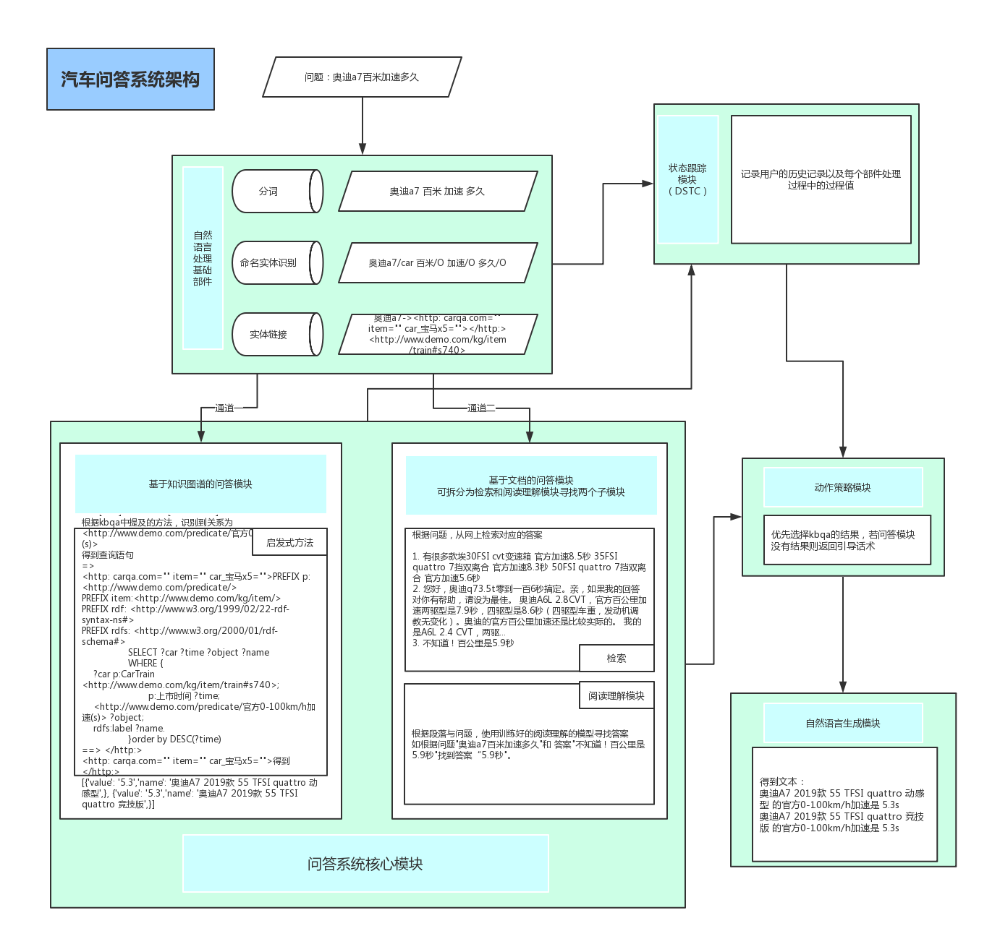

# 技术文档-对话流程与其他

## 1 对话流程

​	整体对话流程图如下：



​	在对话流程中，当接收到问题时，

1. 首先会将问题通过自然语言处理部件处理得到对应的结果，然后将问题和结果输入问答系统核心模块，得到对应的问答结果。
2. 然后将结果输入到动作策略模块中，得到对应的策略，然后输入自言语言出生模块组织成对应的话术返回给用户。
3. 将问答结果输入到状态跟踪模块中，记录对应的数据，便于下轮对话时提供信息。

​	

## 2 对话状态管理

​	对话状态管理中包括对话状态跟踪与策略生成。

### 2.1 对话状态跟踪

​	该对话主要保存对话信心，供特定情况下系统需要某些数据时提供数据。以下为保存的数据：

1. 实体

   保存最后一次提及到的实体，用于下轮回答中实体缺失时进行补充。如

   如上次问了  **奥迪A7多少钱**

   然后机器人回答了 

   ```
   奥迪A7 2019款 55 TFSI quattro 动感型 的厂商指导价是 790800元
   奥迪A7 2019款 55 TFSI quattro 竞技版 的厂商指导价是 859800元
   ```

   之后又接着问 **百米加速是多少呢**

   那么在回答 **百米加速是多少呢**时将跟踪到上次的实体**奥迪A7**

   然后就会根据

   ```
   <http://www.demo.com/kg/item/train#s740> 奥迪A7
   <http://www.demo.com/predicate/官方0-100km/h加速(s)>
   ```

   进行对应的处理，最终得到结果

   ```
   奥迪A7 2019款 55 TFSI quattro 动感型 的官方0-100km/h加速是 5.3s
   奥迪A7 2019款 55 TFSI quattro 竞技版 的官方0-100km/h加速是 5.3s
   ```

2. 关系与回复话术数据

   解决做选择实体时，回答历史关系的模块

   如上次问了  **奔驰多少钱**

   然后机器人回答了

   ```
   你是想问哪个车系的厂商指导价呢？
   1.奔驰E级AMG
   2.凌特
   3.奔驰G级
   4.奔驰C级(进口)
   5.奔驰CLS级
   ```

   用户回复 **E级**

   那么首先将跟踪到上轮话术中的反问语句，与当前用户的回复 "**E级**"进行匹配，得到**奔驰E级AMG**，从话术数据中得到对应的实体为

   ```
   <http://www.demo.com/kg/item/train#s2718> 奔驰E级AMG
   ```

   并从根据上轮提问的关系

   ```
   <http://www.demo.com/predicate/厂商指导价(元)>
   ```

   进行对应的处理，最终得到结果

   ```
   奔驰E级AMG 2019款 AMG E 53 4MATIC+ 轿跑车 的厂商指导价是 978800元
   奔驰E级AMG 2019款 AMG E 53 4MATIC+ 的厂商指导价是 948800元
   ```

### 2.2 策略生成

​	在策略生成模块中，根据问答模块的结果生成对应的策略，策略动作有inform、choose、guide分别对应提供信息，反问选择以及引导。每个策略会附带相应的数据，供后续自然语言生成模块进行话术生成。

​	其中当inform和choose的详细见KBQA部分对于品牌，车系，和车型的介绍进行输出，guide为当问答系统没有获得答案时，随机从引导话术中选择3个引导用户可以咨询的东西。

## 3 自然语言生成

​	在自然语言生成中，根据2.2中生成的策略，则可以将数据填充到对应的模板，生成话术，展示给用户。

1. 在处理inform的时候，根据数据将汽车实体的名字与关系的名字和关系值填充，返回给用户，如

   ```
   奔驰E级AMG 2019款 AMG E 53 4MATIC+ 轿跑车 的厂商指导价是 978800元
   奔驰E级AMG 2019款 AMG E 53 4MATIC+ 的厂商指导价是 948800元
   ```

2. 在处理choose的时候，则根据汽车品牌下的车型生成对应的列表，返回给用户，如：

   ```
   你是想问哪个车系的厂商指导价呢？
   1.奔驰E级AMG
   2.凌特
   3.奔驰G级
   4.奔驰C级(进口)
   5.奔驰CLS级
   ```

3. 在处理guide的时候，则从引导话术中随机筛选3个进行返回，如：

   ```
   这个我还不清楚，你可以这样问
   奥迪a5什么时候换代
   奥迪q5l是全时四驱吗
   奥迪R8的最高车速是多少公里
   ```
