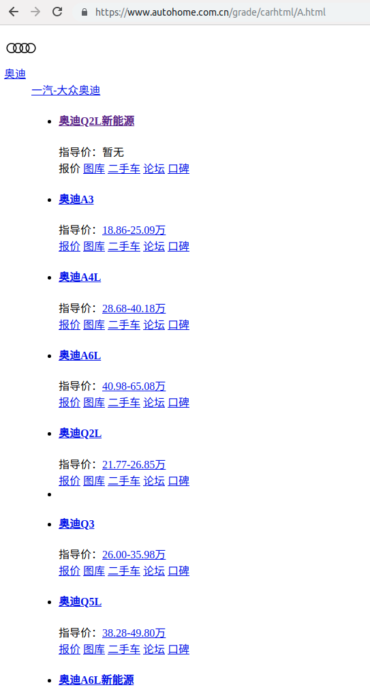
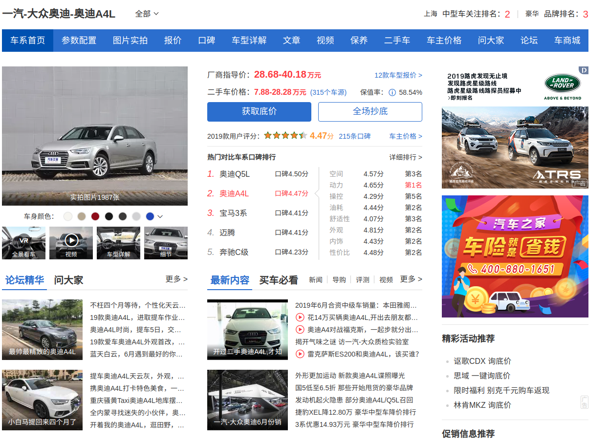
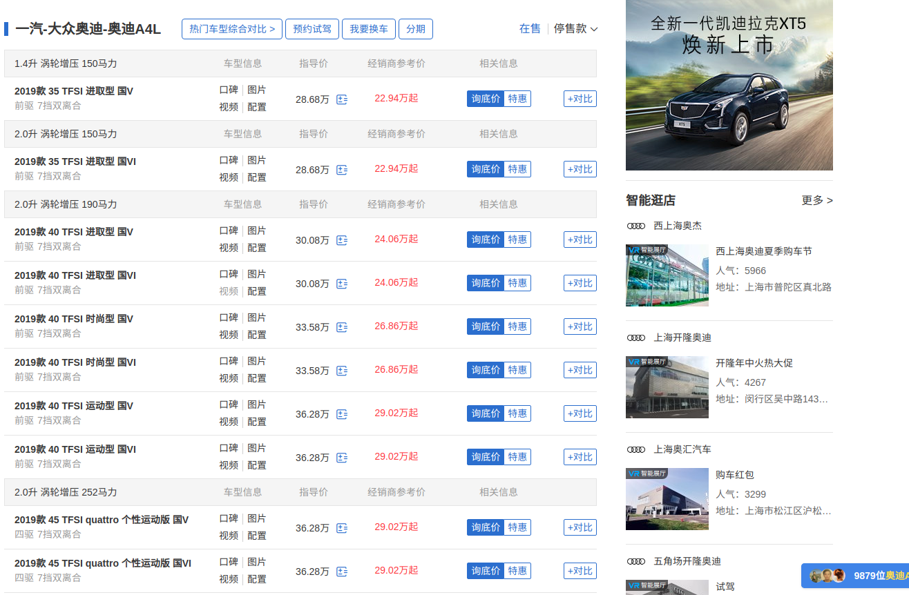
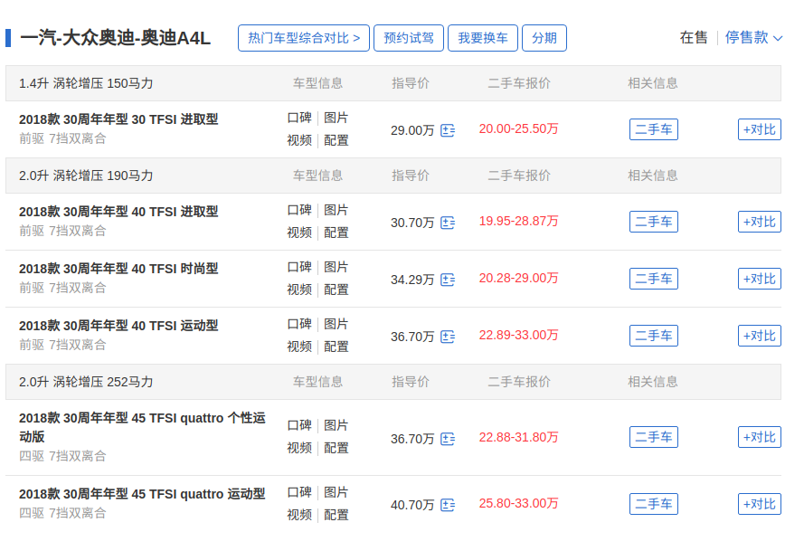
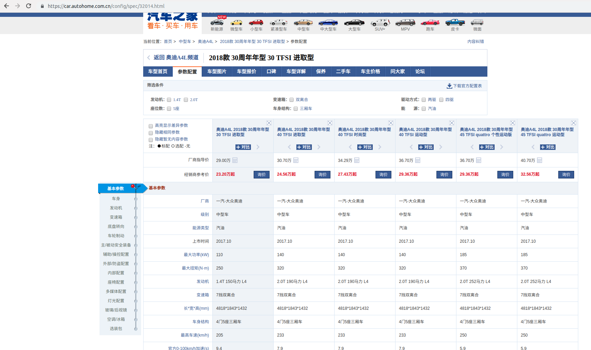

## 技术文档-爬虫与知识图谱构建部分

​	技术文档分为三部分进行介绍，分别为数据爬虫，知识图谱构建

### 1 数据爬虫

​	获取汽车的数据主要从网上的汽车网站获取，考虑到汽车之家的数据为当前最全的，而且其他网站的数据也没他多，因此选择爬取汽车之家的数据。爬取逻辑为先爬取品牌，然后根据品牌爬取各品牌下的车系，再根据车系爬去车型，通过车型爬取配置信息。

#### 1.1 品牌与车系

​	汽车之家的车品牌数据可以通过以下url看到

```
https://www.autohome.com.cn/grade/carhtml/A.html
https://www.autohome.com.cn/grade/carhtml/B.html
...
https://www.autohome.com.cn/grade/carhtml/Z.html
```

​	分别代表了以各字母开头的品牌列表，以及各品牌下生产厂商，和生产厂商下的车系列表，如下



​	因此，可以分析页面的结构，抽取到品牌列表以及车系列表。

#### 1.2 车型

​	通过1.1爬取的车系列表以及对应的url，如

```
奥迪A4L https://www.autohome.com.cn/692/
```

​	打开，页面如下



​	下拉可以找到该车系下面的在售车型列表



​	点击停售款，可以获取各个年份的车型，下图为2018年为例子。



​	分析页面结构，可以获取该页面下所有的年款车型id。

#### 1.3 车型配置

​	通过1.2中获取的车型id，结合汽车之家的车型配置url的规则，构建所有出配置页面url，如

2018款 30周年年型 30 TFSI 进取型 的 id 为 32014，则可以得到url，如下

```
https://car.autohome.com.cn/config/spec/32014.html
```

​	进入页面



​	页面可以看到一个配置列表，需要的车型在第一列，但是因为汽车之家的反爬机制，获取到的页面源码是经过，具体的处理过程就是 会通过js动态选择某些词，然后将页面的这些词全部替换为特殊字符。具体解决办法参考网上的[解决方案](https://www.cnblogs.com/kangz/p/10011348.html)，主要是通过还原这些混淆的文本，替换回去。

#### 1.4 汇总

​	通过爬取，获取的数据量为

| 数据     | 数量  |
| -------- | ----- |
| 汽车品牌 | 320   |
| 生产厂商 | 400   |
| 车系     | 3621  |
| 车型     | 29701 |

### 2 知识图谱构建

#### 2.1 构建

​	通过上面的数据，可以构建一个汽车的知识图谱，主要结构如下

| concept1 | relation | concept2 | 数量      |
| -------- | -------- | -------- | --------- |
| 汽车品牌 | 子品牌   | 生产厂商 | 400       |
| 汽车品牌 | 拥有     | 车系     | 3,621     |
| 生产厂商 | 拥有     | 车系     | 3,621     |
| 车型     | 所属品牌 | 汽车品牌 | 29,701    |
| 车型     | 所属品牌 | 生产厂商 | 29,701    |
| 车型     | 所属车型 | 车系     | 29,701    |
| 车型     | 配置     | 配置信息 | 1,786,049 |

​	通过以上结构，构建出本体，并将数据通过格式化转换转化为rdf数据，rdf三元组数据量为 2,174,025。

​	得到的数据文件样例如下：

```txt
@prefix ns1: <http://www.demo.com/predicate/> .
@prefix rdf: <http://www.w3.org/1999/02/22-rdf-syntax-ns#> .
@prefix rdfs: <http://www.w3.org/2000/01/rdf-schema#> .
@prefix xml: <http://www.w3.org/XML/1998/namespace> .
@prefix xsd: <http://www.w3.org/2001/XMLSchema#> .

<http://www.demo.com/kg/item/CBrain> a <http://www.w3.org/2002/07/owl#Thing> .

<http://www.demo.com/kg/item/brand#102-33> a <http://www.demo.com/kg/item/CBrand> ;
    rdfs:label "奇瑞汽车"@zh ;
    ns1:own <http://www.demo.com/kg/item/train#s613>,
        <http://www.demo.com/kg/item/train#s839>,
        <http://www.demo.com/kg/item/train#s909> ;
    ns1:url "https://car.autohome.com.cn/pic/brand-102-33.html"@zh ;
    rdfs:subClassOf <http://www.demo.com/kg/item/brand#102> .

<http://www.demo.com/kg/item/brand#103-33> a <http://www.demo.com/kg/item/CBrand> ;
    rdfs:label "奇瑞汽车"@zh ;
    ns1:own <http://www.demo.com/kg/item/train#s2109>,
        <http://www.demo.com/kg/item/train#s2173>,
        <http://www.demo.com/kg/item/train#s2507>,
        <http://www.demo.com/kg/item/train#s662>,
        <http://www.demo.com/kg/item/train#s791>,
        <http://www.demo.com/kg/item/train#s797>,
        <http://www.demo.com/kg/item/train#s804>,
        <http://www.demo.com/kg/item/train#s853> ;
    ns1:url "https://car.autohome.com.cn/pic/brand-103-33.html"@zh ;
    rdfs:subClassOf <http://www.demo.com/kg/item/brand#103> .

<http://www.demo.com/kg/item/brand#109-204> a <http://www.demo.com/kg/item/CBrand> ;
    rdfs:label "KTM"@zh ;
    ns1:own <http://www.demo.com/kg/item/train#s911> ;
    ns1:url "https://car.autohome.com.cn/pic/brand-109-204.html"@zh ;
    rdfs:subClassOf <http://www.demo.com/kg/item/brand#109> .

<http://www.demo.com/kg/item/brand#11-34> a <http://www.demo.com/kg/item/CBrand> ;
    rdfs:label "南京菲亚特"@zh ;
    ns1:own <http://www.demo.com/kg/item/train#s465>,
        <http://www.demo.com/kg/item/train#s89>,
        <http://www.demo.com/kg/item/train#s90>,
        <http://www.demo.com/kg/item/train#s91> ;
    ns1:url "https://car.autohome.com.cn/pic/brand-11-34.html"@zh ;
    rdfs:subClassOf <http://www.demo.com/kg/item/brand#11> .

<http://www.demo.com/kg/item/brand#113-375> a <http://www.demo.com/kg/item/CBrand> ;
    rdfs:label "东风雷诺"@zh ;
    ns1:own <http://www.demo.com/kg/item/train#s4119> ;
    ns1:url "https://car.autohome.com.cn/pic/brand-113-375.html"@zh ;
    rdfs:subClassOf <http://www.demo.com/kg/item/brand#113> .

<http://www.demo.com/kg/item/brand#115-303> a <http://www.demo.com/kg/item/CBrand> ;
    rdfs:label "Gumpert"@zh ;
    ns1:own <http://www.demo.com/kg/item/train#s2082>,
        <http://www.demo.com/kg/item/train#s2292>,
        <http://www.demo.com/kg/item/train#s3404> ;
    ns1:url "https://car.autohome.com.cn/pic/brand-115-303.html"@zh ;
    rdfs:subClassOf <http://www.demo.com/kg/item/brand#115> .

<http://www.demo.com/kg/item/brand#118-306> a <http://www.demo.com/kg/item/CBrand> ;
    rdfs:label "Lorinser"@zh ;
    ns1:own <http://www.demo.com/kg/item/train#s2102> ;
    ns1:url "https://car.autohome.com.cn/pic/brand-118-306.html"@zh ;
    rdfs:subClassOf <http://www.demo.com/kg/item/brand#118> .

<http://www.demo.com/kg/item/brand#125-309> a <http://www.demo.com/kg/item/CBrand> ;
    rdfs:label "Tramontana"@zh ;
    ns1:own <http://www.demo.com/kg/item/train#s2249> ;
    ns1:url "https://car.autohome.com.cn/pic/brand-125-309.html"@zh ;
    rdfs:subClassOf <http://www.demo.com/kg/item/brand#125> .

<http://www.demo.com/kg/item/brand#127-311> a <http://www.demo.com/kg/item/CBrand> ;
    rdfs:label "Oullim Motors"@zh ;
    ns1:own <http://www.demo.com/kg/item/train#s2254> ;
    ns1:url "https://car.autohome.com.cn/pic/brand-127-311.html"@zh ;
    rdfs:subClassOf <http://www.demo.com/kg/item/brand#127> .

<http://www.demo.com/kg/item/brand#132-317> a <http://www.demo.com/kg/item/CBrand> ;
    rdfs:label "Fisker"@zh ;
    ns1:own <http://www.demo.com/kg/item/train#s2350>,
        <http://www.demo.com/kg/item/train#s2351>,
        <http://www.demo.com/kg/item/train#s2352>,
        <http://www.demo.com/kg/item/train#s2425>,
        <http://www.demo.com/kg/item/train#s2746>,
        <http://www.demo.com/kg/item/train#s4236> ;
    ns1:url "https://car.autohome.com.cn/pic/brand-132-317.html"@zh ;
    rdfs:subClassOf <http://www.demo.com/kg/item/brand#132> .

<http://www.demo.com/kg/item/brand#135-321> a <http://www.demo.com/kg/item/CBrand> ;
    rdfs:label "TVR"@zh ;
    ns1:own <http://www.demo.com/kg/item/train#s2372>,
        <http://www.demo.com/kg/item/train#s2373>,
        <http://www.demo.com/kg/item/train#s4538> ;
    ns1:url "https://car.autohome.com.cn/pic/brand-135-321.html"@zh ;
    rdfs:subClassOf <http://www.demo.com/kg/item/brand#135> .

<http://www.demo.com/kg/item/brand#136-322> a <http://www.demo.com/kg/item/CBrand> ;
    rdfs:label "Noble"@zh ;
    ns1:own <http://www.demo.com/kg/item/train#s2374>,
        <http://www.demo.com/kg/item/train#s2375>,
        <http://www.demo.com/kg/item/train#s2376>,
        <http://www.demo.com/kg/item/train#s2377> ;
    ns1:url "https://car.autohome.com.cn/pic/brand-136-322.html"@zh ;
    rdfs:subClassOf <http://www.demo.com/kg/item/brand#136> .
```


#### 2.2 存储以及sparql服务

​	安装好jena并启动sparql服务后，上传数据。

​	进行简单的查询，

​	如查询 奥迪A7的价格，按照上市时间排序

```
PREFIX p:<http://www.demo.com/predicate/>
PREFIX item:<http://www.demo.com/kg/item/>
PREFIX rdf: <http://www.w3.org/1999/02/22-rdf-syntax-ns#>
PREFIX rdfs: <http://www.w3.org/2000/01/rdf-schema#>

SELECT ?car ?time ?object ?name
WHERE {
  ?car p:CarTrain <http://www.demo.com/kg/item/train#s740>;
      p:上市时间 ?time;
      <http://www.demo.com/predicate/厂商指导价(元)> ?object;
      rdfs:label ?name.
}order by DESC(?time)
```

​	得到结果如下

| "car"                                        | "time"    | "object" | "name"                                 |
| -------------------------------------------- | --------- | -------- | -------------------------------------- |
| "http://www.demo.com/kg/item/car#spec_35416" | "2018.12" | "790800" | "奥迪A7 2019款 55 TFSI quattro 动感型" |
| "http://www.demo.com/kg/item/car#spec_35417" | "2018.12" | "859800" | "奥迪A7 2019款 55 TFSI quattro 竞技版" |
| "http://www.demo.com/kg/item/car#spec_31515" | "2017.09" | "556000" | "奥迪A7 2018款 35 TFSI 时尚型"         |
| "http://www.demo.com/kg/item/car#spec_31516" | "2017.09" | "612000" | "奥迪A7 2018款 40 TFSI 进取型"         |
| "http://www.demo.com/kg/item/car#spec_31517" | "2017.09" | "658000" | "奥迪A7 2018款 40 TFSI quattro 技术型" |
| "http://www.demo.com/kg/item/car#spec_31518" | "2017.09" | "760000" | "奥迪A7 2018款 50 TFSI quattro 舒适型" |
| "http://www.demo.com/kg/item/car#spec_31519" | "2017.09" | "835000" | "奥迪A7 2018款 50 TFSI quattro 动感型" |
| "http://www.demo.com/kg/item/car#spec_27970" | "2016.09" | "598000" | "奥迪A7 2017款 35 TFSI 时尚型"         |
| "http://www.demo.com/kg/item/car#spec_27971" | "2016.09" | "658000" | "奥迪A7 2017款 40 TFSI 进取型"         |
| "http://www.demo.com/kg/item/car#spec_27972" | "2016.09" | "708000" | "奥迪A7 2017款 40 TFSI quattro 技术型" |
| "http://www.demo.com/kg/item/car#spec_27973" | "2016.09" | "818000" | "奥迪A7 2017款 50 TFSI quattro 舒适型" |
| "http://www.demo.com/kg/item/car#spec_27974" | "2016.09" | "898000" | "奥迪A7 2017款 50 TFSI quattro 动感型" |
| "http://www.demo.com/kg/item/car#spec_25232" | "2016.02" | "598000" | "奥迪A7 2016款 35 TFSI 时尚型"         |
| "http://www.demo.com/kg/item/car#spec_25233" | "2016.02" | "708000" | "奥迪A7 2016款 40 TFSI quattro 技术型" |
| "http://www.demo.com/kg/item/car#spec_23674" | "2015.09" | "658000" | "奥迪A7 2016款 40 TFSI 进取型"         |
| "http://www.demo.com/kg/item/car#spec_23714" | "2015.09" | "818000" | "奥迪A7 2016款 50 TFSI quattro 舒适型" |
| "http://www.demo.com/kg/item/car#spec_23818" | "2015.09" | "938000" | "奥迪A7 2016款 50 TFSI quattro 动感型" |
| "http://www.demo.com/kg/item/car#spec_18224" | "2014.02" | "628000" | "奥迪A7 2014款 30 FSI 时尚型"          |
| "http://www.demo.com/kg/item/car#spec_18225" | "2014.02" | "698000" | "奥迪A7 2014款 30 FSI 进取型"          |
| "http://www.demo.com/kg/item/car#spec_18226" | "2014.02" | "728000" | "奥迪A7 2014款 35 FSI quattro 技术型"  |
| "http://www.demo.com/kg/item/car#spec_18227" | "2014.02" | "828000" | "奥迪A7 2014款 50 TFSI quattro 舒适型" |
| "http://www.demo.com/kg/item/car#spec_18228" | "2014.02" | "958000" | "奥迪A7 2014款 50 TFSI quattro 豪华型" |
| "http://www.demo.com/kg/item/car#spec_13830" | "2012.09" | "818000" | "奥迪A7 2013款 50 TFSI quattro舒适型"  |
| "http://www.demo.com/kg/item/car#spec_13831" | "2012.09" | "958000" | "奥迪A7 2013款 50 TFSI quattro豪华型"  |
| "http://www.demo.com/kg/item/car#spec_13832" | "2012.09" | "698000" | "奥迪A7 2013款 30 FSI 标准型"          |
| "http://www.demo.com/kg/item/car#spec_12676" | "2012.04" | "728000" | "奥迪A7 2013款 35 FSI quattro进取型"   |
| "http://www.demo.com/kg/item/car#spec_11344" | "2011.11" | "818000" | "奥迪A7 2012款 3.0TFSI quattro舒适型"  |
| "http://www.demo.com/kg/item/car#spec_10596" | "2011.08" | "728000" | "奥迪A7 2012款 2.8FSI quattro进取型"   |
| "http://www.demo.com/kg/item/car#spec_10218" | "2011.05" | "958000" | "奥迪A7 2012款 3.0TFSI quattro豪华型"  |